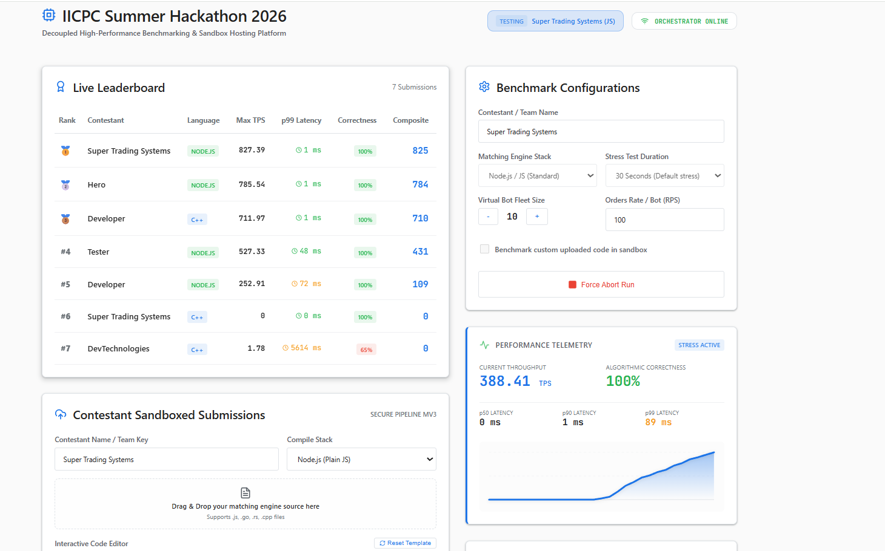
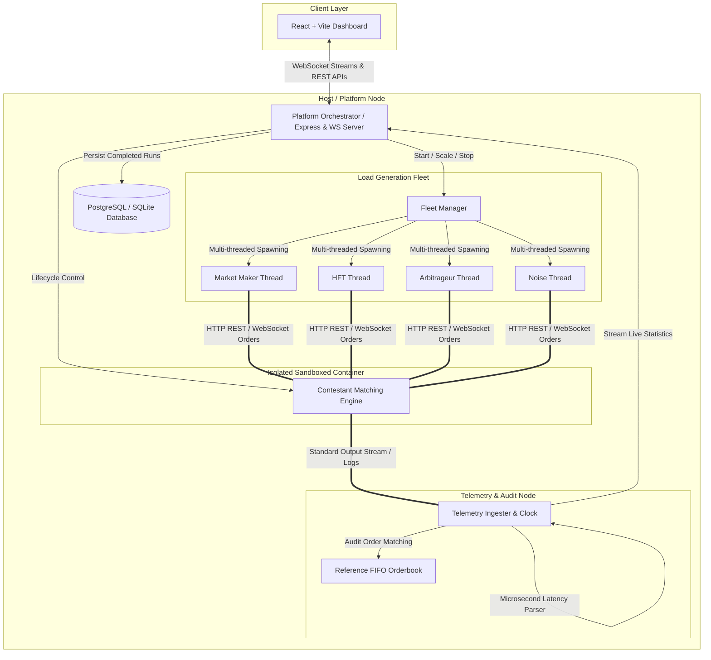

# IICPC Summer Hackathon 2026: Distributed Benchmarking & Hosting Platform



## Overview

This repository contains the source code for the Distributed Benchmarking and Hosting Platform, built for the IICPC Summer Hackathon 2026. The platform is engineered to evaluate, sandbox, and stress-test contestant-submitted trading infrastructure. It orchestrates secure containerized deployments, simulates massive concurrent market order flows, and streams granular telemetry to a real-time leaderboard.

## Live Deployment

The system is deployed and accessible online:
- Frontend Dashboard (Vercel): [https://iicpc-khaki.vercel.app/](https://iicpc-khaki.vercel.app/)
- Backend Services (Render): Hosted securely to process submissions and telemetry.

## Core System Architecture

The platform follows a highly decoupled microservices architecture designed for resilience and performance under extreme load.



## Architectural Components

### 1. Submission & Sandboxing Engine
A secure pipeline utilizing Docker daemon socket mounting (`/var/run/docker.sock`) to containerize and deploy C++, Rust, Go, or Node.js submissions. The engine enforces strict resource isolation (CPU pinning and memory limits) to prevent malicious execution and ensure fair evaluation. A native local execution fallback is implemented for environments where the Docker daemon is unavailable.

### 2. Distributed Load Generator (Bot Fleet)
Built on Node.js worker threads, the fleet scales to spawn thousands of virtual market participants. It generates high-velocity FIX, REST, and WebSocket requests, simulating Market Makers, High-Frequency Traders, Arbitrageurs, and retail order flows to stress the contestant's endpoints.

### 3. Telemetry & Validation Ingester
A zero-overhead tracking system that intercepts the standard output (stdout) of the contestant's engine to measure microsecond-level p50, p90, and p99 latencies alongside maximum Transactions Per Second (TPS). It audits execution accuracy against a pure TypeScript reference orderbook.

### 4. Real-Time Leaderboard & Analytics
A React and Vite frontend employing the native View Transitions API for fluid ranking animations. It utilizes reactive SVG viewport paths to render real-time throughput and latency distributions dynamically.

## Infrastructure as Code (IaC)

Automated deployment scripts are provided in the `deploy/` directory, proving the platform's ability to scale horizontally in modern cloud environments:
- Terraform configurations for provisioning AWS infrastructure (VPC, EKS, RDS).
- Kubernetes manifests including Horizontal Pod Autoscalers (HPA) for dynamic fleet scaling.
- Docker Compose configurations for unified local staging.

## Local Setup Instructions

Prerequisites:
- Node.js (v18+)
- Git
- Docker (Optional, platform falls back to native execution)

### 1. Clone the repository
```bash
git clone https://github.com/Saksham-Gupta-GH/iicpc.git
cd iicpc
```

### 2. Start the Backend Orchestrator
```bash
cd backend
npm install
npm run start
```
Note: The server defaults to port 5050.

### 3. Start the Frontend Dashboard
```bash
cd frontend
npm install
npm run dev
```
Navigate to `http://localhost:5173` to access the local deployment.

## Repository Structure

- `backend/`: Express and WebSockets server handling orchestration and telemetry.
- `bot-fleet/`: Multi-threaded dynamic market traffic load generator.
- `contestant-examples/`: Reference matching engine implementations.
- `deploy/`: Infrastructure as Code (Terraform, K8s manifests, Compose).
- `frontend/`: Real-time leaderboard dashboard.

## Technical Deliverables

This repository contains all necessary deliverables for the IICPC Summer Hackathon 2026:
- Working Infrastructure Prototype (Source code and live deployment).
- Architecture Blueprint (Detailed in `architecture_blueprint.md`).
- Infrastructure as Code (Located in `deploy/`).
