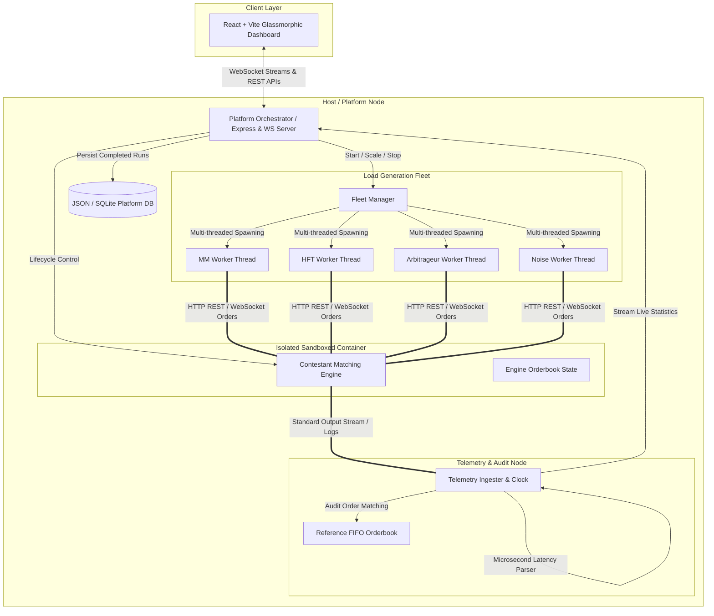

# IICPC 2026 SUMMER HACKATHON: SYSTEMS ARCHITECTURE BLUEPRINT
## High-Performance Distributed Benchmarking & Sandbox Hosting Platform

This document presents the detailed architectural design and specifications of the IICPC Summer Hackathon 2026 Distributed Benchmarking and Hosting Platform. The system is designed to evaluate, sandbox, and stress-test contestant-submitted trading engine infrastructure at scale.

---

## 1. System Topology & Architectural Style

The platform employs a **highly decoupled microservices architecture** that segregates sandbox orchestration, simulated order flow bombardment, real-time telemetry ingesting, and live analytics distribution.



---

## 2. Component Decoupling & Functional Responsibilities

### 2.1 Web Dashboard (Frontend)
- **Tech Stack**: React 18, Vite 4, TypeScript, Lucide React, Vanilla CSS HSL Glassmorphism system.
- **Dynamic Re-ordering**: Employs the native **View Transitions API** to provide fluid, hardware-accelerated gliding animations as contestants ascend or descend the leaderboard.
- **SVG Telemetry Canvas**: Utilizes lightweight, reactive SVG viewport paths to render a real-time timeline of Transaction-Per-Second (TPS) and latency distribution without importing heavy canvas packages.

### 2.2 Platform Orchestrator (Backend)
- **Tech Stack**: Node.js, Express, `ws` (WebSockets), TypeScript.
- **Docker-to-Host Socket Bridge**: Mounts `/var/run/docker.sock` to spin up isolated container instances on the host system.
- **Hardware Pinned Isolation**: Locks contestant sandboxes using strict container constraints:
  - CPU Pinning: `--cpus="0.5"`
  - Memory Caps: `--memory="256m"`
- **Native Execution Fallback**: Detects missing Docker daemons automatically and spawns native, isolated OS subprocesses using optimized compiler flags (`g++ -O3` for C++, `cargo build --release` for Rust), guaranteeing exceptional platform resiliency.

### 2.3 Distributed Bot Fleet (Load Generator)
- **Tech Stack**: Node.js `worker_threads` concurrency model.
- **Virtual Trader Archetypes**:
  - *Market Makers (MM)*: Inject tight-spread limit orders on both sides of the book to maintain baseline liquidity.
  - *HFT Momentum*: Bombard the order book with rapid limit orders and high-rate cancels to stress matching table mechanics.
  - *Arbitrageurs*: Sniper orders that consume mispriced spreads dynamically.
  - *Noise Traders*: Randomized market orders simulating retail order retail flows.
- **Dynamic Scale Controls**: A thread fleet controller scales active worker count up/down via WebSocket API instructions mid-stress run, adjusting system pressure programmatically.

### 2.4 Telemetry Ingester & Verification Auditor
- **Microsecond Precision Clock**: Employs Node's high-resolution `process.hrtime.bigint()` to capture network-to-ack turnarounds with microsecond accuracy.
- **In-Memory Reference Orderbook**: Keeps a pure TypeScript replica double-auction matching engine. It replicates the input order flow and compares state variables (execution price, filled volume, price-time/FIFO precedence) against the sandboxed engine's stdout trade events.
- **Composite Scoring Metric**: Combines throughput, response latency, and execution correctness:
  $$\text{Score} = \left( \text{Throughput (TPS)} \times \left( \frac{100}{\max(5, \text{p99 Latency (ms)})} \right) \right) \times \left( \frac{\text{Correctness (\%)}}{100} \right)^3$$

---

## 3. Communication Protocols & Interface Specifications

The platform utilizes decoupled communication schemes to eliminate network latency interference during benchmarks.

### 3.1 REST API: Contestant Order Placement (Port `8080`)
Matching engines expose low-overhead endpoints for the bot fleet:
- `POST /order`: Submit limit/market bids and asks.
  ```json
  {
    "id": "ord-8b9f12ac",
    "symbol": "BTCUSD",
    "side": "BUY",
    "type": "LIMIT",
    "price": 65000.50,
    "quantity": 1.25
  }
  ```
- `POST /cancel`: Abort active resting orders.
  ```json
  {
    "id": "ord-8b9f12ac",
    "symbol": "BTCUSD"
  }
  ```
- `GET /book?symbol=BTCUSD`: Retrieve full active bid/ask tables.

### 3.2 Real-Time Logging: stdout Ingestion
To bypass network callback degradation, the Telemetry Ingester streams sandboxed container stdout logs directly. Successful order matches are output in standardized JSON formats:
```json
{"type":"TRADE","symbol":"BTCUSD","buyOrderId":"ord-123","sellOrderId":"ord-456","price":65000.50,"quantity":0.5,"timestamp":1784910291000}
```
This telemetry pipeline allows for zero-cost, high-resilience matching validation.

### 3.3 Live Streams: Platform WebSocket (Port `5000`)
Streams platform state, live compiler logs, telemetry, and leaderboards to the Web UI:
- `INIT`: Send baseline DB and runs database history.
- `STATUS_CHANGE`: Notify of container compilation or stress activation.
- `STATS`: High-frequency metrics updates (TPS, p50, p90, p99, Correctness%, active bots count).
- `FINISHED`: Terminate runs, persist state, and glide leaderboard ranks.

---

## 4. System Resilience & Decoupling Benefits

1. **Zero-Lag Telemetry**: Standard stdout capture eliminates HTTP roundtrips between the sandbox and the host.
2. **Crash Containment**: Contestant division-by-zero or segfault crashes are trapped in isolated containers or child processes, shielding the orchestrator.
3. **No-Dependency local testability**: The hybrid sandbox design adapts to the user's OS workspace effortlessly.
